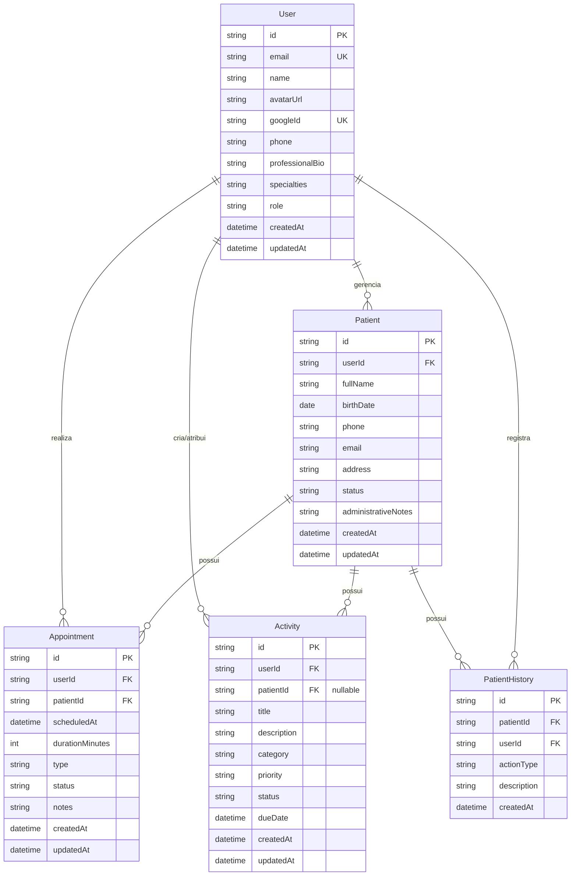

# FisioPro - Documento de Análise e Planejamento Arquitetural (PEX)

Este documento detalha o planejamento arquitetural, funcional e de engenharia de software para o projeto acadêmico de extensão (PEX - Análise e Desenvolvimento de Sistemas) denominado **FisioPro**.

---

## 1. Visão Geral do Sistema

O **FisioPro** é uma solução web *full-stack* concebida para atender profissionais autônomos de fisioterapia (iniciando pela atuação em estágio/início de carreira). O sistema resolve dois gargalos fundamentais do fisioterapeuta:
1. **Presença Digital & Atração**: Um portfólio público elegante, moderno e otimizado para conversão, apresentando áreas de atuação, currículo e canal direto de agendamento/contato via WhatsApp.
2. **Gestão Operacional Simplificada**: Uma área administrativa privada para controle de pacientes, agenda de atendimentos, tarefas internas/externas e histórico de interações administrativas — sem a sobrecarga de prontuários clínicos hospitalares complexos, focando em organização, segurança e conformidade com diretrizes de privacidade (LGPD).

---

## 2. Requisitos do Sistema

### 2.1. Requisitos Funcionais (RF)

- **RF01 - Portfólio Público**: Apresentar biografia, formação, especializações, serviços, localização aproximada/modalidades de atendimento (domiciliar/clínica) e canais de contato.
- **RF02 - Conversão/Contato Público**: Formulário de solicitação de agendamento/contato com integração direta para conversa estruturada via WhatsApp (API `wa.me`).
- **RF03 - Autenticação Segura via Google OAuth**: Permitir login administrativo seguro via Google. Apenas contas autorizadas/cadastradas têm acesso aos dados operacionais.
- **RF04 - Gestão de Perfil Profissional**: Edição de dados do fisioterapeuta (foto, bio, telefone, redes sociais) que alimentam dinamicamente a área pública.
- **RF05 - Dashboard Gerencial**: Exibir métricas e resumos diários/semanais (total de pacientes ativos, atendimentos do dia/semana, tarefas pendentes, próximos compromissos).
- **RF06 - Gestão de Pacientes (CRUD)**: Cadastro, listagem, visualização detalhada, edição, desativação (soft delete/inativação) e busca/filtros por nome, status e telefone.
- **RF07 - Gestão de Atendimentos**: Agendamento de sessões com vínculo a paciente, data, horário, modalidade/tipo e status (`Agendado`, `Confirmado`, `Em andamento`, `Finalizado`, `Cancelado`).
- **RF08 - Gestão de Atividades/Tarefas**: CRUD de atividades internas ou vinculadas a pacientes, com categorias, prioridades (`Baixa`, `Média`, `Alta`) e prazos.
- **RF09 - Linha do Tempo / Histórico Administrativo**: Registro automático de eventos chave do paciente (cadastro, alterações cadastrais, atendimentos realizados, tarefas concluídas).

### 2.2. Requisitos Não Funcionais (RNF)

- **RNF01 - Segurança & Isolamento**: Arquitetura desacoplada em que o frontend consome estritamente uma API RESTful; nenhuma credencial de banco ou regra de negócio é exposta ao cliente.
- **RNF02 - Autenticação & Sessão Confiável**: Emissão de sessões autenticadas pelo backend via cookies `HttpOnly`, `Secure`, `SameSite=Lax/Strict` ou JWT em cookie seguro, prevenindo ataques de XSS e interceptações.
- **RNF03 - Responsividade Completa (Mobile-First)**: Layout fluído e adaptativo para Smartphones (360px+), Tablets (768px+) e Desktops (1024px+), com navegação otimizada (Drawer/Bottom navigation em telas menores).
- **RNF04 - Desempenho & Custo Zero**: Capacidade de operar dentro dos limites gratuitos de serviços em nuvem (*free tiers*) sem custos fixos e com estratégias de minimização de impacto de *cold starts*.
- **RNF05 - Conformidade e Privacidade (LGPD)**: Minimização na coleta de dados (apenas campos estritamente necessários para contato e agendamento) e proteção de dados cadastrais.

---

## 3. Stack Recomendada & Justificativa Acadêmica

A stack foi selecionada para balancear simplicidade de aprendizado, modernidade e facilidade de sustentação em banca acadêmica:

| Camada | Tecnologia | Justificativa Técnica & Acadêmica |
| :--- | :--- | :--- |
| **Frontend** | **React 18/19 + TypeScript + Vite** | Padrão moderno da indústria. Alta performance com Vite (ESM nativo), tipagem estática que previne erros em tempo de compilação. |
| **Estilização** | **Tailwind CSS + Lucide Icons** | Design system consistente através de utility classes, altamente customizável, leve e responsivo sem dependência de bibliotecas pesadas de componentes genéricos. |
| **Roteamento & Estado** | **React Router DOM + TanStack Query (React Query)** | Separação clara de rotas públicas/privadas; React Query gerencia cache, revalidação e loading states automaticamente. |
| **Backend** | **Node.js com Fastify (ou Express) + TypeScript** | Recomendamos **Fastify** com TypeScript: possui arquitetura modular por plugins, alta performance, validação nativa de esquemas e sintaxe limpa para explicação em banca. |
| **Validação** | **Zod** | Validação centralizada de schemas tanto no backend (parsing de requests) quanto no frontend (formulários), garantindo contratos de tipos consistentes (Infer). |
| **Banco de Dados** | **PostgreSQL (via Neon Serverless)** | Banco relacional robusto e ACID. O **Neon** oferece free tier sem suspensão agressiva de projeto e conexão pooler serverless integrada. |
| **ORM / Query Builder** | **Prisma ORM** | Sintaxe declarativa, geração automática de migrações (`prisma migrate`), tipos gerados automaticamente e interface gráfica de dados (`prisma studio`) ideal para o desenvolvimento e apresentação acadêmica. |

---

## 4. Estrutura de Pastas Proposta (Monorepo Simples)

```
pex-fisioterapia/
├── apps/
│   ├── backend/
│   │   ├── prisma/
│   │   │   ├── schema.prisma
│   │   │   └── migrations/
│   │   ├── src/
│   │   │   ├── config/             # Variáveis de ambiente validadas (env.ts)
│   │   │   ├── modules/            # Módulos organizados por domínio de negócio
│   │   │   │   ├── auth/           # OAuth Google, geração de tokens/cookies
│   │   │   │   ├── users/          # Perfil profissional da fisioterapeuta
│   │   │   │   ├── patients/       # CRUD, filtros e regras de pacientes
│   │   │   │   ├── appointments/   # Agenda, fluxos de atendimento
│   │   │   │   ├── activities/     # Tarefas e pendências
│   │   │   │   ├── dashboard/      # Métricas e agregações consolidadas
│   │   │   │   └── history/        # Timeline e logs administrativos
│   │   │   ├── shared/             # Middlewares (auth, error-handling, rate-limit)
│   │   │   ├── server.ts           # Inicialização e registro de plugins
│   │   │   └── app.ts              # Instância do Fastify e rotas
│   │   ├── package.json
│   │   └── tsconfig.json
│   │
│   └── frontend/
│       ├── public/                 # Favicon, assets públicos e logos
│       ├── src/
│       │   ├── assets/             # Imagens e vetores
│       │   ├── components/         # Componentes compartilhados (Navbar, Sidebar, Modals, Badges)
│       │   ├── layouts/            # PublicLayout (Landing) e DashboardLayout (Admin com Sidebar)
│       │   ├── pages/
│       │   │   ├── public/         # Landing Page, Sobre, Serviços, Contato
│       │   │   ├── auth/           # Login administrativo e callback OAuth
│       │   │   └── admin/          # Dashboard, Pacientes, Atendimentos, Atividades, Perfil
│       │   ├── services/           # Clientes HTTP (Axios) e endpoints da API
│       │   ├── hooks/              # Custom hooks (useAuth, useToast, etc.)
│       │   ├── types/              # Definições TypeScript
│       │   ├── App.tsx             # Definição de rotas públicas/protegidas
│       │   └── main.tsx
│       ├── package.json
│       └── vite.config.ts
├── .gitignore
├── .env.example
└── README.md
```

---

## 5. Modelo de Dados Relacional & Esquema



### Detalhes das Entidades:
1. **User**: Contém os dados da fisioterapeuta autenticada via Google. Armazena também os campos do perfil profissional exibidos na landing page.
2. **Patient**: Dados cadastrais e de contato básicos. `status` é enum (`ACTIVE`, `INACTIVE`).
3. **Appointment**: Sessões agendadas. `status` é enum (`SCHEDULED`, `CONFIRMED`, `IN_PROGRESS`, `COMPLETED`, `CANCELLED`).
4. **Activity**: Tarefas gerenciais (ex: "Enviar orientações pós-atendimento", "Confirmar sessão de amanhã"). Pode ter `patientId` opcional.
5. **PatientHistory**: Auditoria leve e visual da linha do tempo do paciente (ações como `PATIENT_CREATED`, `APPOINTMENT_SCHEDULED`, `APPOINTMENT_COMPLETED`, etc.).

---

## 6. Fluxo de Autenticação (Google OAuth 2.0)

Para máxima segurança sem expor segredos ao frontend:
1. **Início do Login**: O frontend redireciona o usuário para `GET /api/auth/google` no backend (ou abre o Google Identity Service pop-up/redirect).
2. **Consentimento Google**: O usuário autoriza na tela oficial da Google.
3. **Callback no Backend**: O Google redireciona para `GET /api/auth/google/callback?code=...`.
4. **Troca de Token no Servidor**: O backend troca o código temporário pelo `id_token` e `access_token` diretamente com os servidores da Google (segredo `GOOGLE_CLIENT_SECRET` nunca sai do backend).
5. **Validação e Localização/Criação**: O backend valida o e-mail retornado. Se for o e-mail autorizado da fisioterapeuta, obtém/cria o registro `User`.
6. **Emissão de Sessão Segura**: O backend emite um JWT assinado armazenado em cookie `HttpOnly`, `Secure`, `SameSite=Lax`.
7. **Redirecionamento**: Redireciona o usuário para o dashboard do frontend (`/admin/dashboard`).
8. **Proteção de Rotas**: Cada requisição do frontend ao backend envia o cookie automaticamente. O middleware de autenticação valida a assinatura do token e injeta `user` na requisição.

---

## 7. Fluxo de Atendimento Visual & Prático

Demonstração do ciclo de vida da relação com o paciente para defesa acadêmica:
```
[Contato Inicial / Portfólio]
           ↓
[Cadastro do Paciente] (Status: Ativo)
           ↓ (Gera evento no Histórico)
[Agendamento de Atendimento] (Status: Agendado)
           ↓
[Confirmação Prévia] (Status: Confirmado + Atividade concluída)
           ↓
[Sessão / Atendimento] (Status: Em Andamento)
           ↓
[Conclusão do Atendimento] (Status: Finalizado)
           ↓ (Gera evento no Histórico + Opcional: Nova atividade de acompanhamento)
[Acompanhamento / Próxima Sessão]
```

---

## 8. Estratégia de Segurança e LGPD

1. **Proteção de Dados & LGPD**:
   - Princípio da finalidade e minimização: não coletamos anamneses patológicas profundas nem exames clínicos nesta etapa de gestão.
   - Restrição estrita de acesso: apenas usuários autenticados e autorizados podem consultar dados de pacientes.
2. **Camada de Transporte & Aplicação**:
   - HTTPS obrigatório em produção (fornecido nativamente pela Vercel e Render/Railway).
   - Headers de segurança com `Helmet` (Content Security Policy, X-Frame-Options, XSS Protection).
   - Rate limiting no backend para prevenir ataques de negação de serviço e força bruta.
   - CORS restrito à URL do frontend em produção.
3. **Validação & Sanitização**:
   - Todo payload de entrada é rigorosamente validado e tipado com Zod antes de atingir as camadas de serviço ou banco.
   - Prisma ORM utiliza prepared statements por padrão, eliminando riscos de SQL Injection.
4. **Gerenciamento de Segredos**:
   - Nenhuma credencial ou chave de API salva em repositório Git. Arquivo `.env.example` claro e documentado.

---

## 9. Estratégia de Deploy Gratuito (Zero Custo)

| Componente | Provedor Recomendado | Plano / Free Tier | Mitigações de Limitações |
| :--- | :--- | :--- | :--- |
| **Frontend** | **Vercel** | Free Hobby (Zero Custo) | Deploy automático via Git, CDN global, SSL automático, build otimizado. |
| **Backend** | **Render** ou **Railway** | Free / Trial tier | No Render Free há *cold start* (suspensão após 15 min de inatividade). Mitigação: feedback visual no frontend ("Iniciando servidor, aguarde alguns segundos...") ou ping de liveness leve. |
| **Banco de Dados** | **Neon PostgreSQL** | Free Tier (0.5 GB de storage, compute serverless) | Não expira nem pausa bancos com atividade esporádica; performance de ponta para projetos acadêmicos. |

---

## 10. Riscos Mapeados & Estratégias de Mitigação

1. **Cold Start do Backend Gratuito**:
   - *Risco*: Primeira requisição demorar de 30 a 50 segundos para responder se o servidor estiver inativo.
   - *Mitigação*: Implementar tela amigável de "Aquecendo sistema..." caso a primeira requisição demore mais de 3 segundos, demonstrando controle de UX para a banca.
2. **Complexidade do OAuth em Ambiente Local vs Produção**:
   - *Risco*: URIs de redirecionamento no Google Cloud Console com mismatch entre `localhost` e domínio da Vercel.
   - *Mitigação*: Configurar desde o início as duas URIs autorizadas no Google Console e variáveis dinâmicas de redirecionamento.
3. **Escopo Clínico vs Escopo de Gestão**:
   - *Risco*: Tentação de adicionar prontuário eletrônico completo, diagnósticos ou prescrições (gerando responsabilidades regulatórias complexas do CFM/COFFITO).
   - *Mitigação*: Manter firme a fronteira em gestão, agenda, acompanhamento e portfólio.

---

## 11. Roteiro de Execução em Fases Pequenas e Testáveis

Conforme estabelecido, o desenvolvimento segue um fluxo modular e estritamente testável passo a passo:

- **FASE 1**: Setup estrutural do projeto (monorepo simples `apps/backend` e `apps/frontend`, configs de TypeScript, Git e `.env.example`).
- **FASE 2**: Modelagem e configuração do Banco de Dados (Neon PostgreSQL + Prisma ORM + Migrações iniciais).
- **FASE 3**: Backend Base (Configuração do Fastify/Express, middlewares de segurança Helmet, CORS, Rate Limit e tratamento global de erros).
- **FASE 4**: Autenticação Segura (Integração Google OAuth + emissão de sessão/cookie + middleware de proteção).
- **FASE 5**: Frontend Base & Design System (Vite, React Router, Tailwind CSS, paleta de cores para área de saúde/fisioterapia e layouts base).
- **FASE 6**: Dashboard Administrativo (Cards de métricas, gráficos simples ou resumos de atendimentos do dia e tarefas).
- **FASE 7**: Módulo de Pacientes (CRUD completo, listagem com filtros e busca, visualização com abas).
- **FASE 8**: Módulo de Atendimentos (Agenda, agendamentos, atualização de status e visualização de próximos atendimentos).
- **FASE 9**: Módulo de Atividades (Gestão de tarefas com prioridades, categorias e prazos).
- **FASE 10**: Histórico / Timeline do Paciente (Geração automática de eventos e visualização limpa).
- **FASE 11**: Portfólio Público (Landing page elegante, apresentação da fisioterapeuta, serviços e integração WhatsApp).
- **FASE 12**: Auditoria de Segurança & Tratamento LGPD (Sanitização, logs seguros e validações de borda).
- **FASE 13**: Refinamento de Responsividade & Mobile Experience (Drawer de navegação, tabelas adaptadas e formulários otimizados).
- **FASE 14**: Testes e Validação Completa (Testes de endpoints de API e fluxo de navegação ponta a ponta).
- **FASE 15**: Deploy em Produção (Vercel + Render/Railway + Neon) e Documentação Final / README para apresentação do PEX.
